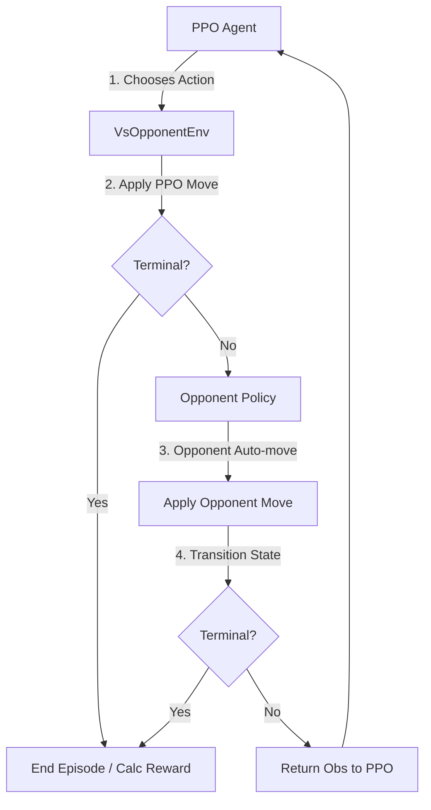

# Reinforcement Learning Training Notes

## Diagnosis of Current Environment Collusion

In our first training run (Phase 9A), we trained a single PPO policy in the `AnimalShogiEnv` environment. Since the game alternates turns between `BLACK` and `WHITE` every step, the single PPO agent was responsible for choosing actions for *both* sides of the board.

### The Problem: Cooperative Collusion
In reinforcement learning, the PPO agent's goal is to maximize the total reward (discounted sum of rewards) collected during an episode. 
Our reward structure was defined as:
* Winner receives `+1.0`
* Loser receives `-1.0`
* Step penalty of `-0.001` per ply to encourage fast winning.

Because a single policy controlled both sides, the agent realized that the optimal way to maximize the expected return was to **cooperate with itself** to end the game as fast as possible. 
For example:
1. **BLACK** (PPO) makes an opening move.
2. **WHITE** (PPO) immediately plays a suicidal move (e.g., walking the Lion into a square where it can be captured by BLACK).
3. **BLACK** (PPO) captures the Lion and wins.

The episode ends in 3 plies. The total reward collected is `+1.0 - 0.003 = 0.997`, which is extremely high. If the agent had played competitively, the game might have lasted 30 plies, resulting in a much lower reward due to step penalties, and a 50% chance of losing `-1.0`.

This collusion explains the metrics observed in the 20M step log:
* `ep_len_mean = 3` (average game length is only 3 steps)
* `ep_rew_mean = 0.998` (almost perfect reward on every episode)
* `explained_variance = 1` (perfectly predictable environment transitions)
* `entropy_loss = -0.0383` (very low entropy, meaning the policy became completely deterministic in its collusion pattern)

Rather than learning to play competitively, the model learned to cooperate to solve a speed puzzle.

---

## Architectural Refactoring: `VsOpponentEnv`

To train a truly competitive agent, we must break the collusion by introducing a single-agent training environment where the learning policy only controls **one side** (e.g., `BLACK`), while the opponent is played by a separate, independent policy (e.g., a `RandomAgent` or a heuristic agent).



### Key Differences:
1. **Perspective Consistency**: The PPO agent always views the board from its assigned player perspective (e.g. `BLACK` or `WHITE`). The observation is encoded and perspective-normalized automatically.
2. **Independent Adversary**: The opponent makes moves using its own strategy (e.g. random) and does not cooperate with the training policy to optimize the episode return.
3. **True Adversarial Reward**: The reward is calculated strictly from the perspective of the PPO player:
   - PPO wins: `+1.0`
   - PPO loses: `-1.0`
   - Draw: `0.0`
   - Step penalty: `-0.001`

## Phase 9C: PPO vs Heuristic Opponent

The next practical training target is `train-maskable-ppo-vs-heuristic`.
It keeps the single-side `AnimalShogiVsOpponentEnv` structure but replaces the random
opponent with a deterministic one-ply heuristic policy plus random tie-breaking.

The heuristic opponent:

- prefers immediate winning moves, especially Lion capture;
- avoids moves that allow its own Lion to be captured next turn when alternatives exist;
- values captures, Chick promotion, material, and small positional advancement;
- still chooses only from `GameState.legal_actions()`.

This version is intentionally conservative. It does not add complex reward shaping yet;
the important architectural fix is that PPO controls only one side while a separate
opponent controls the other side. For Mac Air training, start with a smoke run before
launching a longer job:

```bash
animal-shogi-lab train-maskable-ppo-vs-heuristic \
  --side BLACK \
  --timesteps 10000 \
  --n-envs 4 \
  --seed 0 \
  --step-penalty -0.0001
```
